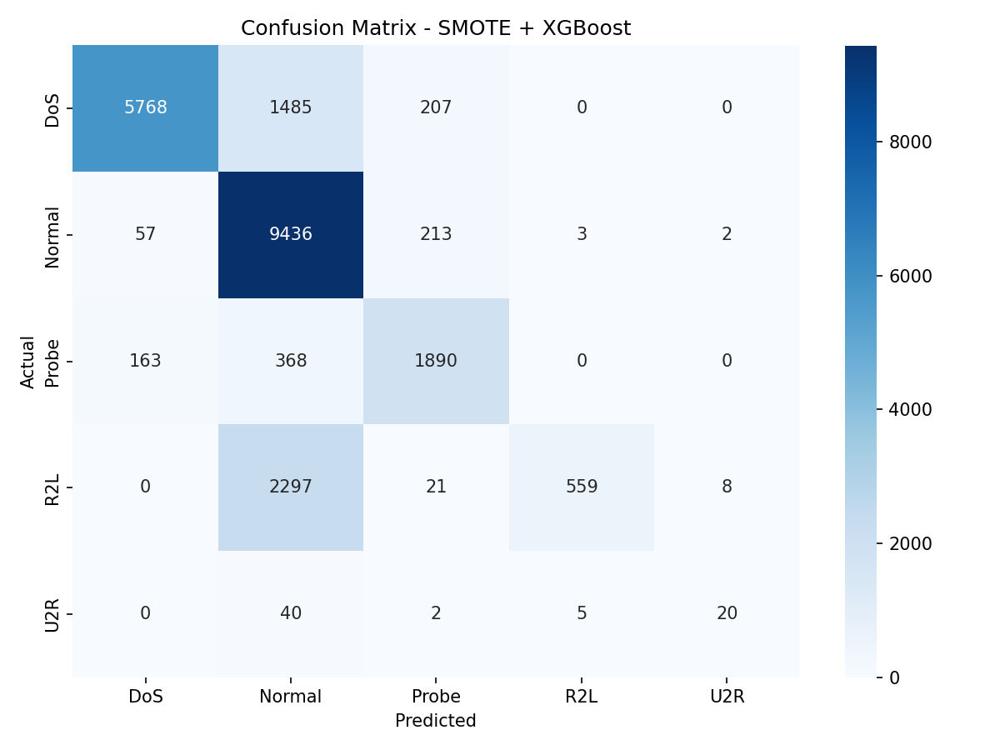

# Network Intrusion Detection Report

---

**Course:** Advanced Python (ICS0019)

**Team members:** Gloria Vimberg, Marta Meesak

**Date:** 23.05.2026

**Repository link:** https://github.com/gloriavimb/nids-project/tree/main

---

# 1. Approach

## 1.1 Strategy Overview

The goal of this project was to build a machine learning model that could classify network traffic into five categories using the NSL-KDD dataset:

- Normal
- DoS (Denial of Service)
- Probe
- R2L (Remote-to-Local)
- U2R (User-to-Root)

At first, we started with a simple baseline model to better understand how the dataset behaves. Since the dataset is highly imbalanced, especially for R2L and U2R attacks, we mainly focused on improving minority class detection.

We first tested a baseline Random Forest model, then tried imbalance handling techniques such as SMOTE, and later experimented with stronger models like XGBoost. Different approaches were compared and the best-performing one was selected based on macro F1-score.

---

## 1.2 Preprocessing

The starter code already handled most of the preprocessing.

### Feature engineering

No additional features were created.

### Feature selection

The feature `num_outbound_cmds` was removed because it contained only zero values and therefore had no predictive value.

### Scaling

No scaling was applied.

Since tree-based models such as Random Forest and XGBoost were mainly used, feature scaling was not necessary.

### Other preprocessing

The following categorical features were label encoded:

- `protocol_type`
- `service`
- `flag`

The original attack labels were grouped into five categories:

- Normal
- DoS
- Probe
- R2L
- U2R

---

## 1.3 Class Imbalance Handling

One of the main challenges in this dataset is class imbalance.

Most of the data belongs to Normal or DoS traffic, while U2R attacks are extremely rare. Because of this, the model can easily learn majority classes and ignore rare attacks.

To improve this, several imbalance handling techniques were tested:

- `class_weight='balanced'`
- SMOTE
- BorderlineSMOTE
- different SMOTE settings (`k_neighbors`)
- XGBoost parameter tuning

In the end, regular **SMOTE combined with XGBoost** gave the best results.

---

# 2. Experiments

## Experiment 1: Random Forest Baseline

- **Algorithm:** Random Forest
- **Imbalance handling:** None
- **Macro F1 (test):** 0.5009

### Observation

The baseline model worked reasonably well for majority classes such as Normal and DoS, but struggled with minority attack types, especially R2L and U2R.

---

## Experiment 2: Random Forest with Class Weights

- **Algorithm:** Random Forest
- **Imbalance handling:** `class_weight='balanced'`
- **Macro F1 (test):** 0.4753

### Observation

We expected class balancing to improve performance, but it actually made the score slightly worse. This suggested that balancing alone was not enough for this dataset.

---

## Experiment 3: SMOTE + Random Forest

- **Algorithm:** Random Forest
- **Imbalance handling:** SMOTE
- **Macro F1 (test):** 0.5246

### Observation

Adding SMOTE improved performance on minority attack classes and slightly improved the overall macro F1-score.

---

## Experiment 4: XGBoost

- **Algorithm:** XGBoost
- **Imbalance handling:** None
- **Macro F1 (CV):** 0.9422 ± 0.0146
- **Macro F1 (test):** 0.5368

### Observation

XGBoost performed better than Random Forest overall, but the model still struggled to detect R2L and U2R attacks.

---

## Experiment 5: SMOTE + XGBoost

- **Algorithm:** XGBoost
- **Imbalance handling:** SMOTE
- **Macro F1 (CV):** 0.9461 ± 0.0221
- **Macro F1 (test):** 0.6343

### Observation

Combining SMOTE with XGBoost significantly improved minority class detection and resulted in a much higher macro F1-score.

---

## Experiment 6: Tuned SMOTE + XGBoost

- **Algorithm:** XGBoost
- **Imbalance handling:** SMOTE
- **Macro F1 (CV):** 0.9507 ± 0.0182
- **Macro F1 (test):** **0.6396**

### Observation

After tuning XGBoost parameters, the score improved slightly. This became the final and best-performing model.

---

## Additional Experiments

We also tested:

- SMOTE with `k_neighbors=3`
- BorderlineSMOTE
- sample weighting inside XGBoost

These approaches did not improve the final score compared to the tuned SMOTE + XGBoost model.

---

## Experiments Summary

| # | Description | Algorithm | Imbalance Handling | Macro F1 (CV) | Macro F1 (test) |
|---|---|---|---|---:|---:|
| 1 | Baseline | Random Forest | None | — | 0.5009 |
| 2 | Balanced RF | Random Forest | Class weights | — | 0.4753 |
| 3 | SMOTE + RF | Random Forest | SMOTE | — | 0.5246 |
| 4 | XGBoost | XGBoost | None | 0.9422 ± 0.0146 | 0.5368 |
| 5 | SMOTE + XGBoost | XGBoost | SMOTE | 0.9461 ± 0.0221 | 0.6343 |
| 6 | Tuned SMOTE + XGBoost | XGBoost | SMOTE | **0.9507 ± 0.0182** | **0.6396** |

---

# 3. Final Results

## 3.1 Best Model

The final and best-performing model was **SMOTE + tuned XGBoost**.

### Key parameters

```python
n_estimators = 500
max_depth = 8
learning_rate = 0.03
subsample = 0.9
colsample_bytree = 0.9
random_state = 42
```

Pipeline used:

```text
SMOTE → XGBoost
```

---

## 3.2 Final Macro F1-Score

| Metric | Score |
|---|---:|
| **Macro F1 (test)** | **0.6396** |
| Macro F1 (CV) | 0.9507 ± 0.0182 |

---

## 3.3 Classification Report

| Category | Precision | Recall | F1-Score | Support |
|---|---:|---:|---:|---:|
| DoS | 0.96 | 0.77 | 0.86 | 7460 |
| Normal | 0.69 | 0.97 | 0.81 | 9711 |
| Probe | 0.81 | 0.78 | 0.80 | 2421 |
| R2L | 0.99 | 0.19 | 0.32 | 2885 |
| U2R | 0.67 | 0.30 | 0.41 | 67 |

---

## 3.4 Confusion Matrix



The confusion matrix shows that the model performs well on Normal, DoS, and Probe traffic. R2L attacks are still difficult to classify correctly, but the final model improved R2L and U2R detection compared to earlier experiments.

---

# 4. Cross-Validation vs. Test Score

- **CV macro F1:** 0.9507 ± 0.0182
- **Test macro F1:** 0.6396
- **Gap:** 0.3111

## Analysis

The cross-validation score was much higher than the final test score.

This is expected because the KDDTest+ dataset contains attack types that do not appear in the training data. The model performs very well on patterns it has already seen, but unseen attacks are harder to classify correctly.

This may suggest some level of overfitting, but the difference is also expected because the KDDTest+ dataset contains attack types that do not appear in the training data.

---

# 5. What Worked and What Didn't

## What had the biggest positive impact?

The biggest improvement came from combining **SMOTE with XGBoost**.

Compared to the baseline Random Forest model, the final model performed much better on minority classes, especially R2L and U2R.

The macro F1-score improved from:

```text
0.5009 → 0.6396
```

which was a noticeable improvement.

---

## What surprisingly didn't help?

Using `class_weight='balanced'` with Random Forest did not improve the results and actually made them slightly worse.

We also tried BorderlineSMOTE and changing SMOTE parameters, but these approaches did not outperform the final tuned model.

---

## What would we try with more time?

With more time, we would try:

- more hyperparameter tuning
- threshold tuning for minority classes
- ensemble or stacking models
- additional feature engineering
- a two-stage classifier (attack vs normal, then attack type)

---

# Appendix: Environment

- **Hardware:** Apple MacBook + Lenovo ThinkPad
- **Python version:** 3.9
- **Key libraries:**
  - pandas
  - scikit-learn
  - xgboost
  - imbalanced-learn
  - seaborn
  - matplotlib
- **Random seed:** 42